# 🔍 Infrastructure de Supervision Centralisée AWS - Zabbix

[](https://aws.amazon.com)
[](https://www.zabbix.com)
[](https://www.docker.com)
[](https://www.postgresql.org)

## 📋 Description du Projet

Déploiement d'une infrastructure complète de monitoring centralisée sur AWS utilisant **Zabbix** conteneurisé avec Docker pour surveiller un parc hybride composé de machines **Linux** et **Windows**.

Ce projet démontre la mise en œuvre d'une solution de supervision moderne basée sur le cloud, permettant la collecte et la visualisation en temps réel de métriques système (CPU, RAM, disque, réseau) sur plusieurs instances EC2.

---

## 🎯 Objectifs

- ✅ Déployer une infrastructure cloud complète sur AWS (VPC, EC2, Security Groups)
- ✅ Conteneuriser Zabbix Server avec Docker et Docker Compose
- ✅ Configurer la surveillance d'un parc hybride (Linux et Windows)
- ✅ Mettre en place des tableaux de bord et des alertes de monitoring
- ✅ Documenter l'ensemble du processus de déploiement

---

## 🏗️ Architecture

### Schéma d'Infrastructure

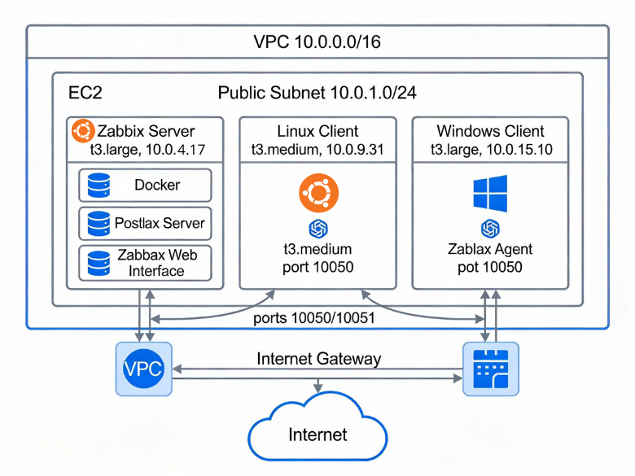

### Composants

| Composant | Type | OS | IP Privée | Rôle |
|-----------|------|----|-----------|----- |
| **Zabbix Server** | t3.large | Ubuntu 22.04 | 10.0.4.17 | Serveur de monitoring |
| **Client Linux** | t3.medium | Ubuntu 22.04 | 10.0.9.31 | Machine surveillée |
| **Client Windows** | t3.large | Windows Server 2022 | 10.0.15.10 | Machine surveillée |

### Stack Technique

- **Cloud Provider**: AWS (us-east-1)
- **Conteneurisation**: Docker & Docker Compose 3.8
- **Monitoring**: Zabbix 6.4 (Alpine Linux)
- **Base de données**: PostgreSQL 15 (Alpine)
- **Agents**: Zabbix Agent 2 (Linux) / Zabbix Agent 7.0.22 (Windows)

---

## 🚀 Déploiement

### 1. Configuration du Réseau AWS

#### Création du VPC


- **Bloc CIDR VPC**: 10.0.0.0/16
- **Sous-réseau public**: 10.0.1.0/24
- **Région**: us-east-1 (N. Virginia)
- **Internet Gateway**: Attaché au VPC

#### Configuration Security Groups


| Type | Port | Protocole | Source |
|------|------|-----------|--------|
| HTTP | 80 | TCP | 0.0.0.0/0 |
| HTTPS | 443 | TCP | 0.0.0.0/0 |
| Zabbix Agent | 10050 | TCP | 10.0.0.0/16 |
| Zabbix Server | 10051 | TCP | 10.0.0.0/16 |
| SSH | 22 | TCP | 0.0.0.0/0 |
| RDP | 3389 | TCP | 0.0.0.0/0 |

### 2. Lancement des Instances EC2

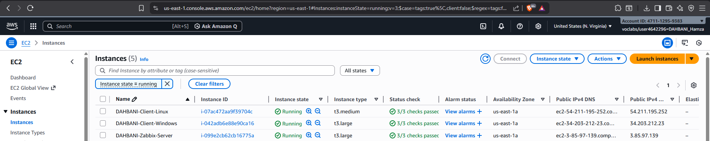

```bash
# Instances créées avec tags personnalisés
# - DAHBANI-Zabbix-Server (t3.large)
# - DAHBANI-Client-Linux (t3.medium)
# - DAHBANI-Client-Windows (t3.large)
```

### 3. Installation Docker sur le Serveur Zabbix

```bash
# Connexion SSH au serveur
ssh -i your-key.pem ubuntu@IP_PUBLIQUE_ZABBIX

# Mise à jour et installation Docker
sudo apt update && sudo apt upgrade -y
sudo apt install -y docker-ce docker-ce-cli containerd.io docker-compose-plugin

# Vérification
docker --version
docker compose version
```

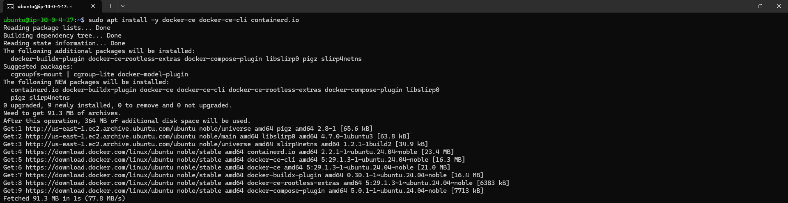

### 4. Déploiement de Zabbix avec Docker Compose

```bash
# Créer le répertoire du projet
mkdir -p ~/zabbix && cd ~/zabbix

# Créer le fichier docker-compose.yml (voir ci-dessous)
nano docker-compose.yml

# Lancer les conteneurs
docker compose up -d

# Vérifier l'état
docker compose ps
```

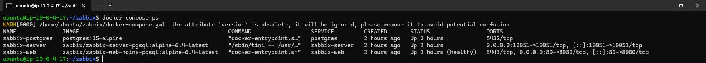

#### Fichier `docker-compose.yml`

```yaml
version: '3.8'

services:
  postgres:
    image: postgres:15-alpine
    container_name: zabbix-postgres
    restart: always
    environment:
      POSTGRES_USER: zabbix
      POSTGRES_PASSWORD: zabbix_pass_2025
      POSTGRES_DB: zabbix
    volumes:
      - postgres-data:/var/lib/postgresql/data
    networks:
      - zabbix-net

  zabbix-server:
    image: zabbix/zabbix-server-pgsql:alpine-6.4-latest
    container_name: zabbix-server
    restart: always
    environment:
      DB_SERVER_HOST: postgres
      POSTGRES_USER: zabbix
      POSTGRES_PASSWORD: zabbix_pass_2025
      POSTGRES_DB: zabbix
      ZBX_CACHESIZE: 256M
    ports:
      - "10051:10051"
    depends_on:
      - postgres
    volumes:
      - zabbix-data:/var/lib/zabbix
    networks:
      - zabbix-net

  zabbix-web:
    image: zabbix/zabbix-web-nginx-pgsql:alpine-6.4-latest
    container_name: zabbix-web
    restart: always
    environment:
      DB_SERVER_HOST: postgres
      POSTGRES_USER: zabbix
      POSTGRES_PASSWORD: zabbix_pass_2025
      POSTGRES_DB: zabbix
      ZBX_SERVER_HOST: zabbix-server
      PHP_TZ: Africa/Casablanca
    ports:
      - "80:8080"
    depends_on:
      - postgres
      - zabbix-server
    networks:
      - zabbix-net

volumes:
  postgres-data:
  zabbix-data:

networks:
  zabbix-net:
    driver: bridge
```

### 5. Accès à l'Interface Web Zabbix

```
http://IP_PUBLIQUE_SERVEUR_ZABBIX
```

**Identifiants par défaut**:
- Username: `Admin`
- Password: `zabbix`

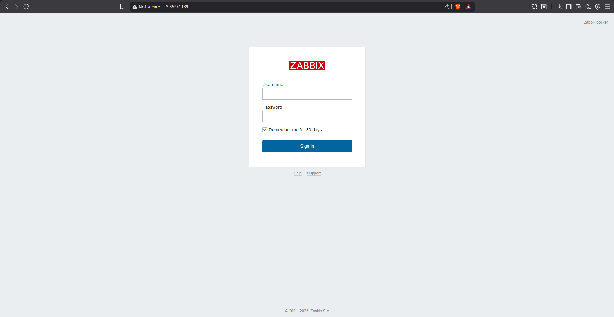
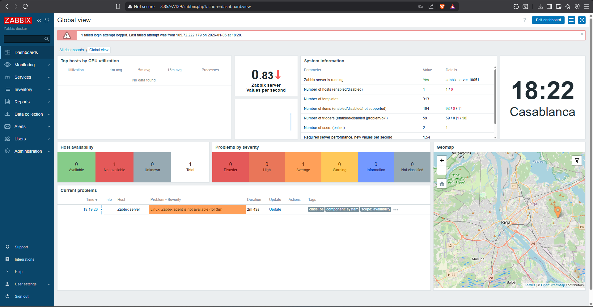

---

## 🖥️ Configuration des Agents

### Agent Linux (Ubuntu)

#### Installation

```bash
# SSH vers le client Linux
ssh -i your-key.pem ubuntu@IP_CLIENT_LINUX

# Télécharger et installer le dépôt Zabbix
wget https://repo.zabbix.com/zabbix/6.4/ubuntu/pool/main/z/zabbix-release/zabbix-release_6.4-1+ubuntu22.04_all.deb
sudo dpkg -i zabbix-release_6.4-1+ubuntu22.04_all.deb
sudo apt update

# Installer l'agent
sudo apt install -y zabbix-agent2
```

#### Configuration

```bash
sudo nano /etc/zabbix/zabbix_agent2.conf
```

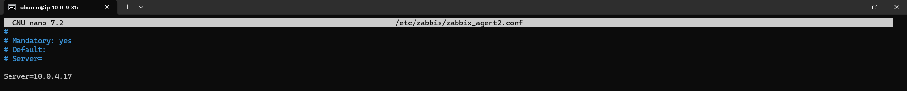
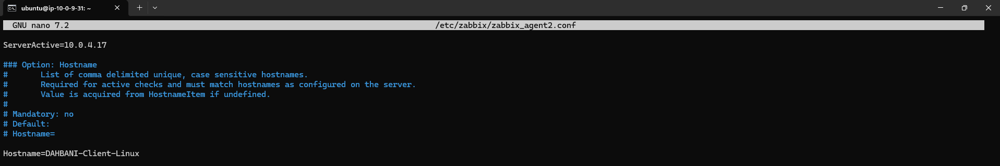

```ini
Server=10.0.4.17
ServerActive=10.0.4.17
Hostname=DAHBANI-Client-Linux
```

```bash
# Démarrer le service
sudo systemctl restart zabbix-agent2
sudo systemctl enable zabbix-agent2
sudo systemctl status zabbix-agent2
```

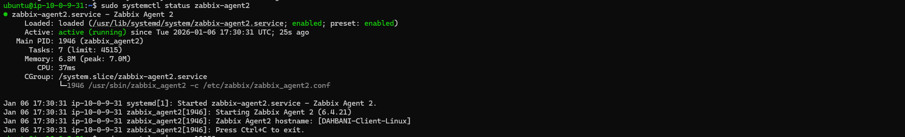

### Agent Windows (Windows Server 2022)

#### Installation

1. Télécharger Zabbix Agent 7.0.22 (MSI) depuis le site officiel
2. Lancer l'installateur MSI

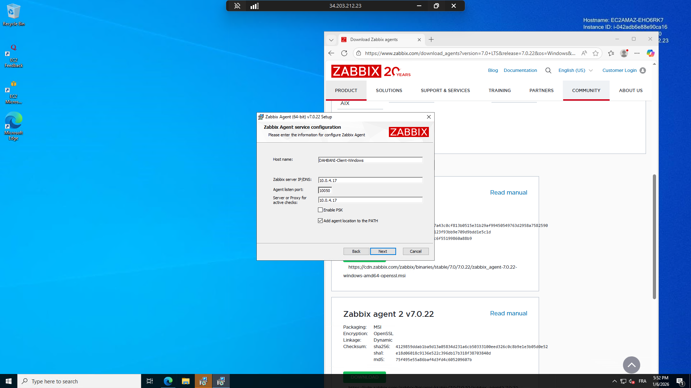

**Paramètres de configuration**:

| Paramètre | Valeur |
|-----------|--------|
| Host name | DAHBANI-Client-Windows |
| Zabbix server IP/DNS | 10.0.4.17 |
| Agent listen port | 10050 |
| Server for active checks | 10.0.4.17 |
| Enable PSK | Non |
| Add to PATH | Oui |

#### Vérification

```powershell
# Vérifier le service
Get-Service "Zabbix Agent 2"

# Vérifier le port d'écoute
netstat -an | findstr 10050

# Créer la règle de pare-feu
New-NetFirewallRule -DisplayName "Zabbix Agent 7.0" `
    -Direction Inbound -LocalPort 10050 -Protocol TCP -Action Allow
```


---

## 📊 Monitoring et Visualisation

### Ajout des Hôtes dans Zabbix

#### Client Linux

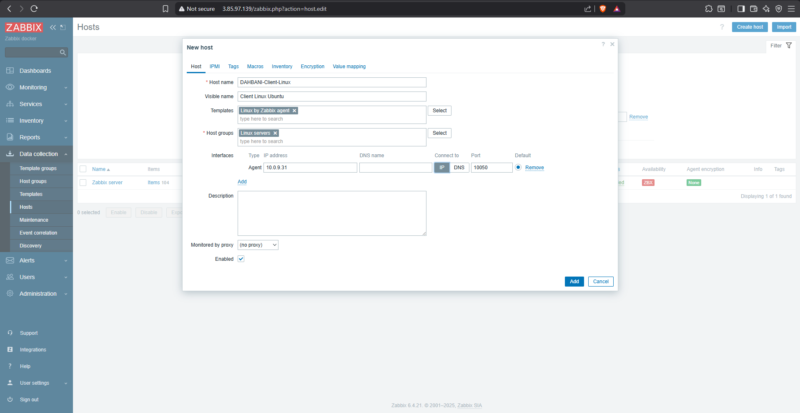

- **Host name**: DAHBANI-Client-Linux
- **Templates**: Linux by Zabbix agent
- **Host groups**: Linux servers
- **Interface**: 10.0.9.31:10050

#### Client Windows

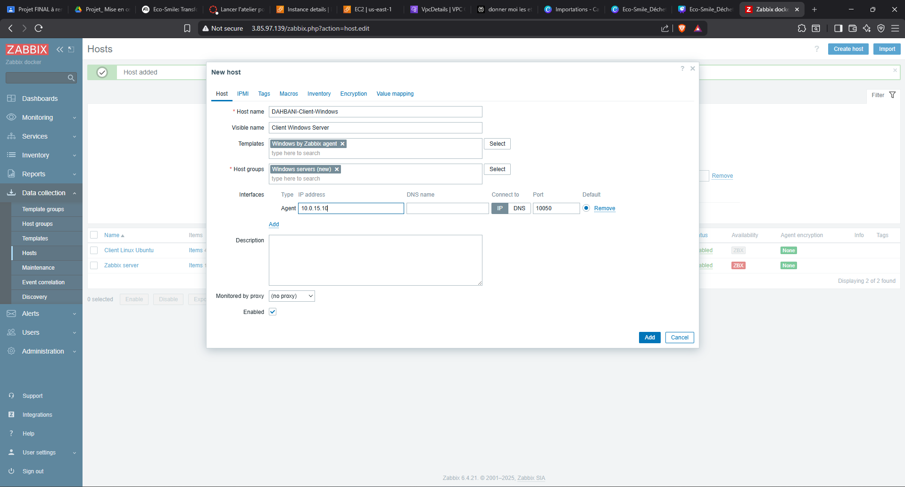

- **Host name**: DAHBANI-Client-Windows
- **Templates**: Windows by Zabbix agent
- **Host groups**: Windows servers
- **Interface**: 10.0.15.10:10050

### Statut des Connexions

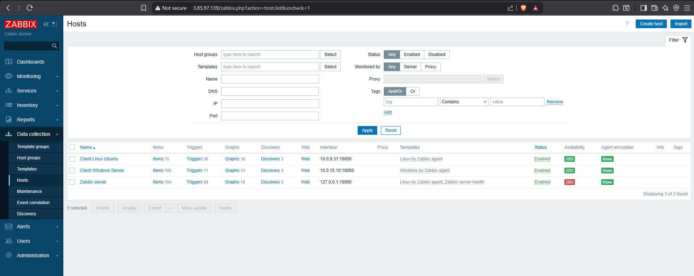

✅ Les deux clients affichent un statut **ZBX en VERT**, confirmant la connexion réussie.

### Métriques Collectées

| Hôte | Items | Triggers | Graphs |
|------|-------|----------|--------|
| Client Linux Ubuntu | 75 | 30 | 16 |
| Client Windows Server | 105 | 71 | 12 |

### Données en Temps Réel

#### Latest Data - Linux

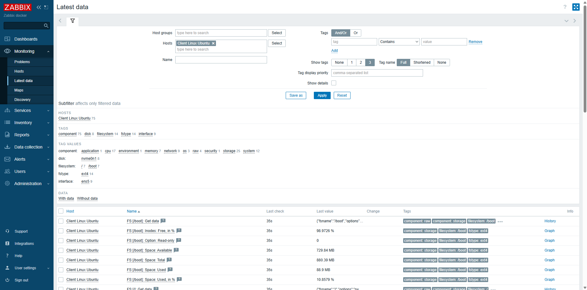

#### Latest Data - Windows

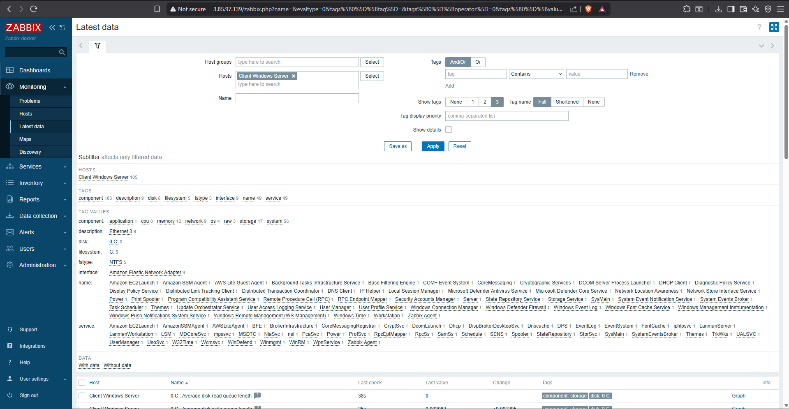

### Graphiques de Performance

#### Utilisation CPU

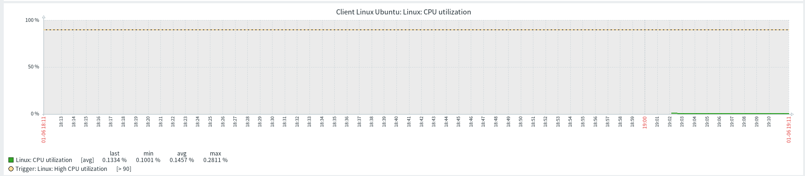

#### Utilisation Mémoire

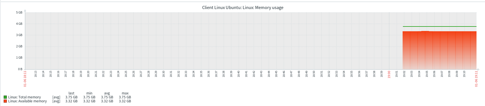

---

## 🧪 Tests et Validation

### Test de Charge CPU

```bash
# Générer une charge CPU sur Linux
yes > /dev/null & yes > /dev/null &

# Arrêter après quelques minutes
killall yes
```

La montée de charge est détectée et visible dans les graphiques Zabbix en temps réel.

---

## 🔧 Commandes Utiles

### Gestion Docker

```bash
# Lancer les conteneurs
docker compose up -d

# Arrêter les conteneurs
docker compose down

# Voir les logs
docker compose logs -f

# Redémarrer après arrêt du Lab AWS
cd ~/zabbix
docker compose up -d
```

### Diagnostic Zabbix

```bash
# Tester la connexion à un agent
docker exec -it zabbix-server zabbix_get -s IP_CLIENT -k agent.ping

# Voir les logs du serveur
docker compose logs zabbix-server

# Vérifier les tables PostgreSQL
docker exec -it zabbix-postgres psql -U zabbix -d zabbix -c "\dt"
```

---

## 🎓 Compétences Acquises

### Techniques

- ✅ Déploiement d'infrastructure sur AWS (VPC, EC2, Security Groups)
- ✅ Configuration et gestion de Zabbix pour monitoring hybride
- ✅ Conteneurisation avec Docker et Docker Compose
- ✅ Administration système Linux (Ubuntu) et Windows Server
- ✅ Configuration de PostgreSQL en conteneur
- ✅ Gestion de réseaux privés virtuels et pare-feu

### Méthodologiques

- ✅ Documentation technique complète
- ✅ Résolution de problèmes complexes
- ✅ Respect d'un cahier des charges
- ✅ Optimisation des coûts cloud

---

## 🐛 Problèmes Rencontrés et Solutions

### 1. Initialisation Base de Données PostgreSQL

**Problème**: Erreur "Database error - Unable to select configuration"

**Solution**: Attendre 3-5 minutes pour l'initialisation complète. Vérifier les logs:

```bash
docker compose logs postgres | grep "ready for connections"
docker compose logs zabbix-server
```

### 2. Certificat RDP Windows

**Problème**: Avertissement de certificat non fiable lors de la connexion RDP

**Solution**: Accepter le certificat auto-signé AWS (comportement normal pour EC2)

### 3. Security Group VPC Mismatch

**Problème**: Erreur lors de l'association du Security Group aux instances

**Solution**: Vérifier que le Security Group et les instances appartiennent au même VPC

---

## 🚀 Améliorations Futures

1. **Haute disponibilité**: Cluster Zabbix avec répartition de charge
2. **Sécurité renforcée**: Activation du chiffrement PSK agent-serveur
3. **Monitoring avancé**: Checks personnalisés et scripts spécifiques
4. **Alerting**: Configuration d'alertes email et intégration Slack/Teams
5. **Multi-zones**: Utilisation de plusieurs Availability Zones AWS
6. **Infrastructure as Code**: Migration vers Terraform
7. **Monitoring applicatif**: Extension aux applications web et bases de données

---

## 📚 Ressources et Documentation

- [Documentation Zabbix 6.4](https://www.zabbix.com/documentation/6.4/)
- [AWS EC2 Documentation](https://docs.aws.amazon.com/ec2/)
- [AWS VPC User Guide](https://docs.aws.amazon.com/vpc/)
- [Docker Compose Documentation](https://docs.docker.com/compose/)
- [Zabbix Docker Containers](https://github.com/zabbix/zabbix-docker)
- [PostgreSQL 15 Documentation](https://www.postgresql.org/docs/15/)

---

## 👤 Auteur

**Étudiant**: DAHBANI Hamza  
**Encadrant**: Prof. Azeddine KHIAT  
**Filière**: Big Data et Cloud Computing  
**Année universitaire**: 2025/2026

---

## 📄 Licence

Ce projet a été réalisé dans un cadre académique.

---

## 🙏 Remerciements

- Prof. Azeddine KHIAT pour l'encadrement du projet
- L'équipe Zabbix pour la solution open-source
- AWS Academy pour l'accès au Learner Lab

---

**⭐ Si ce projet vous a été utile, n'hésitez pas à le star !**
